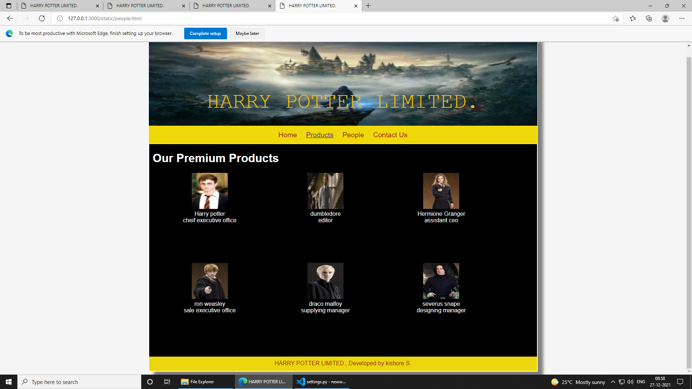

# Web Design for a Software Product Company

## AIM:

To design a static website for a software product company company.

## DESIGN STEPS:

### Step 1:

Requirement collection.

### Step 2:

Creating the layout using HTML and CSS.

### Step 3:

Updating the sample content.

### Step 4:

Choose the appropriate style and color scheme.

### Step 5:

Validate the layout in various browsers.

### Step 6:

Validate the HTML code.

### Step 6:

Publish the website in the given URL.

## PROGRAM :

### Home code:
```
<!DOCTYPE html>
<html lang="en">
  <head>
    <title>HARRY POTTER LIMITED.</title>
    <link rel="stylesheet" href="./css/layout.css" />
    <link rel="icon" href="./img/icon.png" type="image/x-icon" />
  </head>

  <body>
    <div class="container">
      <div class="banner">HARRY POTTER LIMITED.</div>
      <div class="menu">
        <div class="menuitemselected"><a href="/static/home.html">Home</a></div>
        <div class="menuitem"><a href="/static/products.html">Products</a></div>
        <div class="menuitem"><a href="/static/people.html">People</a></div>
        <div class="menuitem"><a herf="/static/contact us.html">contact us</a></div>
      </div>
      <div class="content">
        <div class="homecontent">
          <h1>About Us</h1>
          
          <div class="contenttext">
            At Tally, we believe in the power of technology to make business
            owners efficient, empowered and happier, so they can focus on what
            matters most for their business. We design our products to focus on
            just that to make our products work for you, and not the other way
            around.
            <br />
            Our new product TallyPrime takes this to a new level, making your
            start to automation, or your switch to Tally simpler than ever
            before. You can now discover the product much more easily and make
            the product do more for you, without learning anything new. There is
            greater flexibility as the product adapts to your business and your
            way of working. And the transformed look and feel will only make you
            love the product even more.
            <ul>
              <li>Simple to learn, easier to use</li>
              <li>Insightful , actionable & customizable reports</li>
              <li>Anywhere, anytime and secure access</li>
            </ul>
          </div>
        </div>
      </div>
      <div class="footer">
        Copyright &#169; 2021 HARRY POTTER LIMITED., Developed by kishore S
    </div>
  </body>
</html>
```
### Product code:
```
<!DOCTYPE html>
<html lang="en">
  <head>
    <title>HARRY POTTER LIMITED.</title>
    <link rel="stylesheet" href="./css/layout.css" />
    <link rel="icon" href="./img/icon.png" type="image/x-icon" />
  </head>

  <body>
    <div class="container">
      <div class="banner">HARRY POTTER LIMITED.</div>
      <div class="menu">
        <div class="menuitem"><a href="/static/home.html">Home</a></div>
        <div class="menuitemselected">
          <a href="/static/products.html">Products</a>
        </div>
        <div class="menuitem"><a herf="/static/people.html">people</a></div>
        <div class="menuitem"><a herf="/static/contact us.html">contact us</a></div>
      </div>
      <div class="content">
        <div class="productcontent">    
          <h1>Our Premium Products</h1>
          <div class="productitems">
              <div class="productitem"> 
                  <div class="itemimage">
                  
                  </div>
                  <div class="itemname">Harry potter 1st chapter</div>
                  <div class="itemprice">Price: Rs.1,000.00 </div>
              </div>
              <div class="productitem"> 
                  <div class="itemimage">
                  
                  </div>
                  <div class="itemname">Harry potter 2nd chapter </div>
                  <div class="itemprice">Price: Rs.1,000.00 </div>
              </div>
              <div class="productitem"> 
                <div class="itemimage">
                
                </div>
                <div class="itemname">Harry potter 2nd chapter </div>
                <div class="itemprice">Price: Rs.1,000.00 </div>
              </div>
              <div class="productitem"> 
                <div class="itemimage">
                
                </div>
                <div class="itemname">Harry potter 4th chapter </div>
                <div class="itemprice">Price: Rs.1,000.00 </div>
              </div>
              <div class="productitem"> 
                <div class="itemimage">
                
                </div>
                <div class="itemname">Harry potter 5th chapter </div>
                <div class="itemprice">Price: Rs.1,000.00 </div>
              </div>
              <div class="productitem"> 
                <div class="itemimage">
                
                </div>
                <div class="itemname">Harry potter 6th chapter </div>
                <div class="itemprice">Price: Rs.1,000.00 </div>
              </div>
              <div class="productitem"> 
                <div class="itemimage">
                
                </div>
                <div class="itemname">Harry potter 7th chapter </div>
                <div class="itemprice">Price: Rs.1,000.00 </div>
              </div>
              <div class="productitem"> 
                <div class="itemimage">
                
                </div>
                <div class="itemname">Harry potter 8th chapter </div>
                <div class="itemprice">Price: Rs.1,000.00 </div>
              </div>
              <div class="productitem"> 
                <div class="itemimage">
                
                </div>
                <div class="itemname">Harry potter 1 to 4 chapter </div>
                <div class="itemprice">Price: Rs.4,000.00 </div>
              </div>
              <div class="productitem"> 
                <div class="itemimage">
                
                </div>
                <div class="itemname">Harry potter 5 to 8 chapter </div>
                <div class="itemprice">Price: Rs.1,000.00 </div>
              </div>
              <div class="productitem"> 
                <div class="itemimage">
                
                </div>
                <div class="itemname">Harry potter 1 to 8 chapter </div>
                <div class="itemprice">Price: Rs.8,000.00 </div>
              </div>
              <div class="productitem"> 
                <div class="itemimage">
                
                </div>
                <div class="itemname">Harry potter golden edition </div>
                <div class="itemprice">Price: Rs.5,000.00 </div>
              </div>
          </div>        
      </div>
      <div class="footer">HARRY POTTER LIMITED., Developed by kishore S.
      </div>
    </div>
  </body>
</html>
```
### People code:
```
<!DOCTYPE html>
<html lang="en">
  <head>
    <title>HARRY POTTER LIMITED.</title>
    <link rel="stylesheet" href="./css/layout.css" />
    <link rel="icon" href="./img/icon.png" type="image/x-icon" />
  </head>

  <body>
    <div class="container">
      <div class="banner">HARRY POTTER LIMITED.</div>
      <div class="menu">
        <div class="menuitem"><a href="/static/home.html">Home</a></div>
        <div class="menuitem">
          <a href="/static/products.html">Products</a>
        </div>
        <div class="menuitemselected"><a herf="/static/people.html">People</a></div>
        <div class="menuitem"><a herf="/static/Contact Us.html">contact us</a></div>
      </div>
      <div class="content">
        <div class="productcontent">    
          <h1>Our Premium Products</h1>
          <div class="productitems">
              <div class="productitem"> 
                  <div class="itemimage">
                  
                  </div>
                  <div class="itemname">Harry potter </div>
                  <div class="itemprice"> cheif executive office </div>
              </div>
              <div class="productitem"> 
                  <div class="itemimage">
                  
                  </div>
                  <div class="itemname"> dumbledore </div>
                  <div class="itemprice"> editor </div>
              </div>
              <div class="productitem"> 
                <div class="itemimage">
                
                </div>
                <div class="itemname">Hermione Granger </div>
                <div class="itemprice">assistant ceo </div>
              </div>
              <div class="productitem"> 
                <div class="itemimage">
                
                </div>
                <div class="itemname">ron weasley </div>
                <div class="itemprice"> sale executive office </div>
              </div>
              <div class="productitem"> 
                <div class="itemimage">
                
                </div>
                <div class="itemname">draco malfoy </div>
                <div class="itemprice"> supplying manager</div>
              </div>
              <div class="productitem"> 
                <div class="itemimage">
                
                </div>
                <div class="itemname">severus snape </div>
                <div class="itemprice">designing manager </div>
              </div>
          </div>        
      </div>
      <div class="footer">HARRY POTTER LIMITED., Developed by kishore S.
      </div>
    </div>
  </body>
</html>
```
### Contact code:
```
<!DOCTYPE html>
<html lang="en">
  <head>
    <title>HARRY POTTER LIMITED.</title>
    <link rel="stylesheet" href="./css/layout.css" />
    <link rel="icon" href="./img/m127.png" type="image/x-icon" />
  </head>

  <body>
    <div class="container">
      <div class="banner">HARRY POTTER LIMITED.</div>
      <div class="menu">
        <div class="menuitem"><a href="/static/home.html">Home</a></div>
        <div class="menuitem"><a href="/static/products.html">Products</a></div>
        <div class="menuitem"><a href="/static/people.html">People</a></div>
        <div class="menuitemselected"><a href="/static/Contact us.html">Contact Us</a></div>
      </div>
      <div class="content">
            <div class="productcontent">   
                <div class="homecontent">
                    
                    <div class="contenttext"> 
                <h1>CONTACT US</h1>
                <div class="productitems">
                    <div class="productitem"> 
                            <h2>INDIA</h2><br>
                        <div class="conadd">HARRY POTTER LIMITED.<br>
                            <br>
                            CIN - L72200MH1995PLC091408, Marvel Edge,<br>
                            Office No.7010 C & D, 7th Floor, Viman Nagar,<br>
                            Pune 411014, Maharashtra, India<br></div>
                            <br>
                            <div class="connum">Mobile: +91 8056080046 </div><br>
                            <div class="conem">Email: kishoresujith3@gmail.com</div>
                    </div>        
                </div>
            </div>
        <div class="footer">
                    Copyright &#169; 2021 HARRY POTTER LIMITED., Developed by kishore s.
        </div>
    </div>
        </body>
      </html>
```      


## OUTPUT:

### Home Page:


### Product Page:


### People Page:



### Contact Page:


## Result:

Thus a website is designed for the software product company and the HTML,CSS code are validated.
